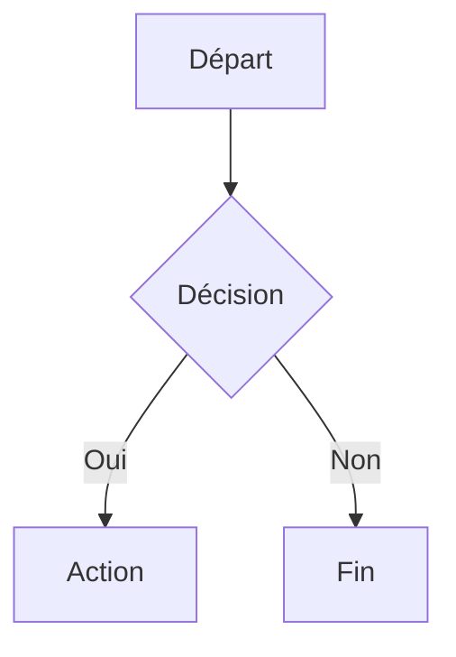
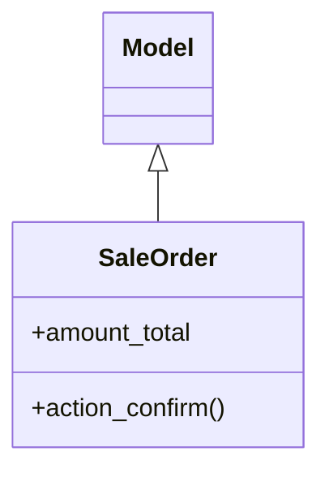

# Mermaid rapide

## Flowchart

```mermaid
flowchart TD
  A[Départ] --> B{Décision}
  B -->|Oui| C[Action]
  B -->|Non| D[Fin]
```

## Class diagram

```mermaid
classDiagram
  class SaleOrder {
    +amount_total
    +action_confirm()
  }
  Model <|-- SaleOrder
```

Règles : IDs ASCII simples, libellés courts, pas de diagramme de plus de 60 nœuds dans une réponse.
