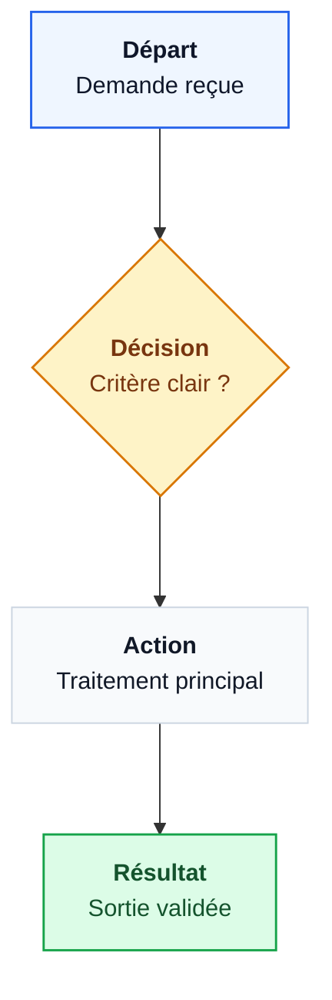
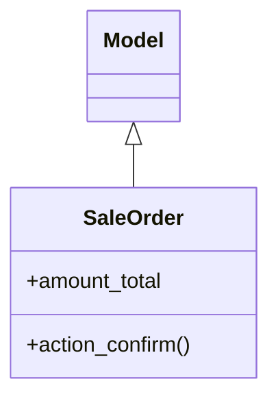

# Mermaid rapide — standard joli

## Flowchart

Règles visuelles :

- Chaque carte a un titre court en gras puis une ligne de détail.
- Les liens restent simples et directs : `A --> B`, pas de longs retours arrière.
- Utiliser `curve: linear` pour éviter les liens courbes libres.
- Limiter les labels de liens aux branches de décision indispensables.
- Si le flux a plusieurs domaines, utiliser des `subgraph` pour séparer les zones.

## Class diagram

Règles : IDs ASCII simples, libellés courts, pas de diagramme de plus de 60 nœuds dans une réponse. Pour un rendu client, préférer 8 à 14 cartes maximum par diagramme et créer une deuxième vue si nécessaire.
