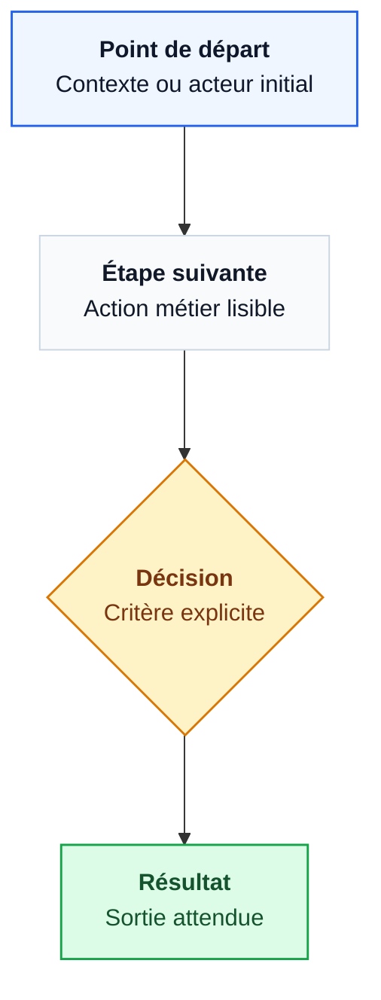

Légende : préciser le périmètre, la source des données et les éléments volontairement exclus.

Checklist qualité :
- chaque carte commence par `<b>Titre</b>` ;
- liens linéaires, courts et orientés dans le même sens ;
- pas de longues boucles de retour ni de branches qui traversent tout le diagramme ;
- 3-5 classes visuelles maximum ;
- si le diagramme devient dense, créer des sous-graphes ou deux diagrammes.
